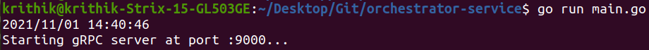
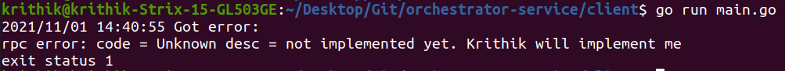
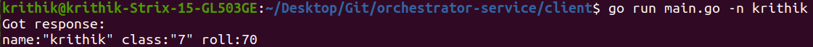
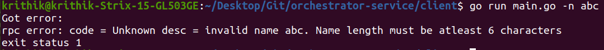

# Orchestrator Service

[](https://goreportcard.com/report/github.com/krithikvaidya/orchestrator-service)

This repository implements an orchestrator service in Golang, according to the instructions mentioned [here](https://github.com/mage-io/documentation/blob/main/exercises/orchestrator.md).

## Instructions to run  

- Clone the repository
```
git clone https://github.com/krithikvaidya/orchestrator-service.git
```

- Install module dependencies
```
go install .
```

- Run mock user data server
```
go run datamock/main.go
```

- Run orchestrator 2
```
go run logic/orchestrator2/orc_2.go
```

- Run orchestrator 1
```
go run logic/orchestrator1/orc_1.go
```

- Run the client (use -n flag to specify username)
```
go run client/main.go -n <username>
```

- If any changes need to be made to the proto file (`users/user.proto`), recompile it using the following command:
```
protoc \
--go_out=. --go_opt=paths=source_relative \
--go-grpc_out=. --go-grpc_opt=paths=source_relative \
user/user.proto
```

## Development Environment

- OS used for development -- Ubuntu 20.04
- Golang version -- 1.17

## Part-wise Documentation:

### Part 2

- The root of the repo contains `main.go`, which implements the server (returns a hardcoded value for now)
- The *client* folder contains the client code which connects to the gRPC server using the client stub, and invokes the *GetUserByName* RPC.
- The *constants* folder contains some constants used by our program
- The *user* folder contains the `user.proto` file (protobufs and RPC definitions), along with the generated *.pb.go* files

#### Screenshots of Output

- Server:


- Client


### Part 3

- The .proto definition in *user/user.proto* has been updated with the MockUserDataService.
- The implementation of the service is in *datamock/main.go*

### Part 4

- Used the same namings as the ones given for the two orchestrators (orchestrator1 and orchestrator2)
- The .proto definition in `user/user.proto` has been updated with the *Orchestrator2Service* 
- The `logic` folder has been created, with two folders `orchestrator1` and `orchestrator2` containing the logic and RPC server implementation for each orchestrator.
- The contents of `main.go` in the root folder (which was created in Part 2 to implement the gRPC server for GetUserByName) has been moved to `logic/orchestrator1/orc_1.go`, along with modifications.
- To ensure graceful shutdown of the gRPC server, a *shutdown* channel and context *cancel()* have been used, along with capturing program stop signals (SIGTERM, SIGINT).

#### Screenshots of Output

- Invoking client with name "krithik":


- Invoking client with name "abc":

